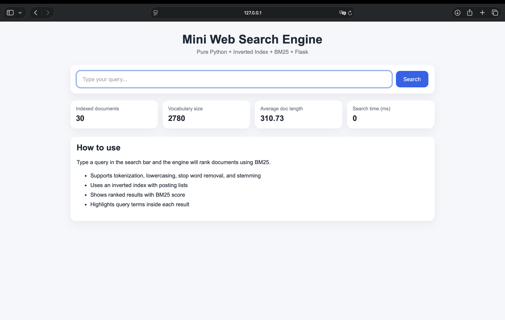
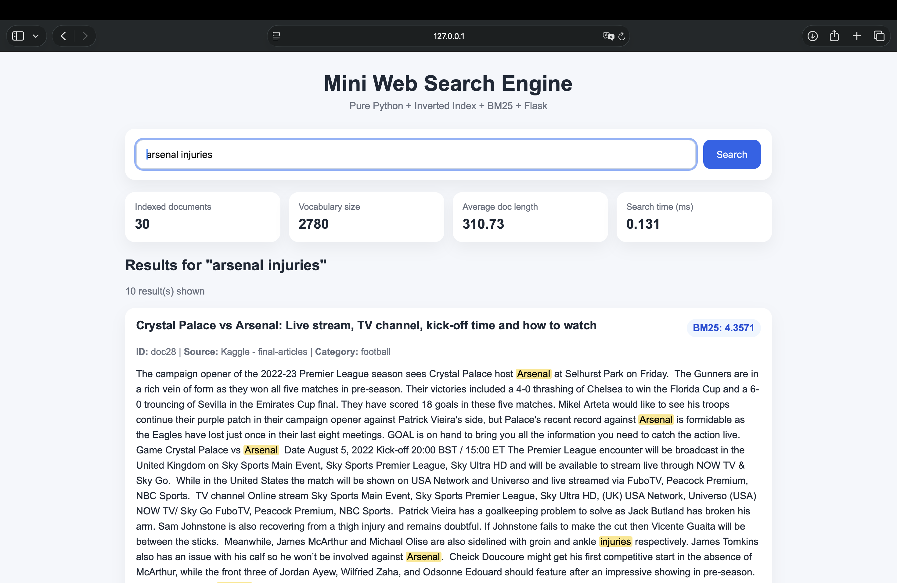
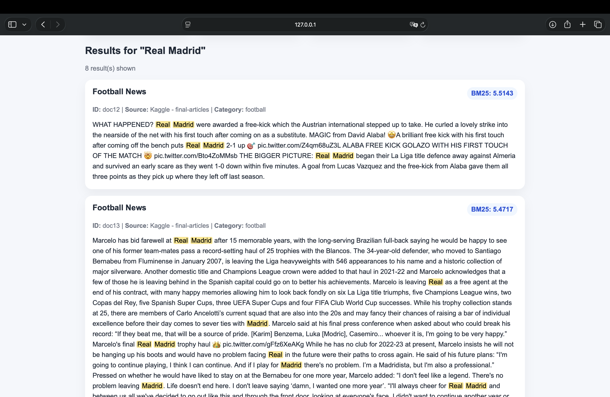

# Mini Web Search Engine

## Student
PAULO JOSE NUNEZ ESPARZA

---

## Chosen Domain
Football News

---

## Project Description
This project implements a mini web search engine using Python. It processes a real-world dataset of football news articles and allows users to search for relevant information using a query-based interface.

The system uses an inverted index and the BM25 ranking algorithm to retrieve and rank documents based on relevance.

---

## Justification
I chose football news because it is a dynamic and constantly updated domain. It includes topics such as transfers, injuries, matches, and competitions, making it ideal for testing a search engine. Users frequently search for specific teams, players, and events, making this domain suitable for keyword-based retrieval models like BM25.

---

## Dataset
The dataset was obtained from Kaggle (Football News Articles).  
It contains real football-related articles.

Dataset characteristics:
- More than 20 documents
- Each document contains more than 50 words
- Each document includes a source
- Data was preprocessed and converted to JSON format

---

## System Architecture

### 1. Text Processing
- Lowercasing
- Tokenization
- Stop word removal
- Stemming (Porter Stemmer)

### 2. Indexing
- Inverted index with posting lists
- Term frequency per document
- Document length tracking

### 3. Ranking
- BM25 ranking algorithm
- Scores documents based on relevance to the query

### 4. Web Interface
- Built with Flask
- Displays results dynamically
- Shows statistics such as:
  - total documents
  - vocabulary size
  - average document length
  - search time

---

## Implemented Enhancement
### A - Term Highlighting

The system highlights query terms within the retrieved documents.  
This improves usability by allowing users to quickly identify why a document was retrieved.

---

## Limitations
- The system relies on lexical matching, so it may not detect synonyms
- It does not implement semantic search or embeddings
- Results depend heavily on the dataset quality

---

```markdown
## Local Run Instructions

1. Create virtual environment (optional):
```bash
python3 -m venv venv

```
2. Activate it:
```bash
source venv/bin/activate
```
3. Install dependencies:
```bash
python3 -m pip install -r requirements.txt
```
4. Run the application:
```bash
python3 app.py
```
5. Open in browser:
http://127.0.0.1:5000


## Screenshots

### Home Page


### Search Results


### Highlighted Terms

